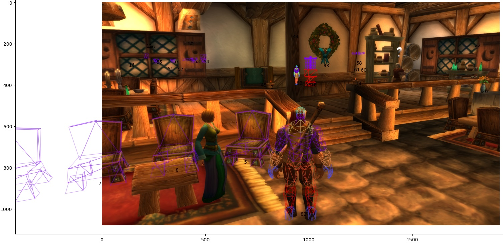

# WOW 1.12 external wireframe renderer reading game's memory

Caveats:
- Only works with windowed-fullscreen 1920x1080 mode (need to fix world-to-screen formula)
- Doesn't render animation (moving objects are rendered as static objects)
- Doesn't render equipement
- Doesn't render world
- Rendering is long, but it's fine if application is not real-time
- No way of knowing if something is occluded

With a complete rendering engine it would be possible record clips of the game accompanied
by the on-screen location of every objects for every frame, thus allowing to experiment with any
computer-vision task without worrying about the labelling of a dataset.

```bat
python truc.py
```


See `truc.py` for informations
